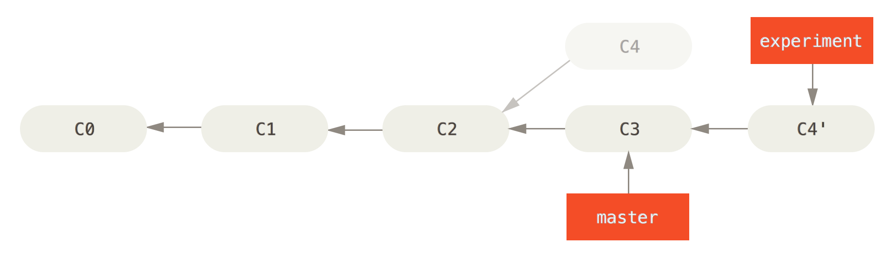
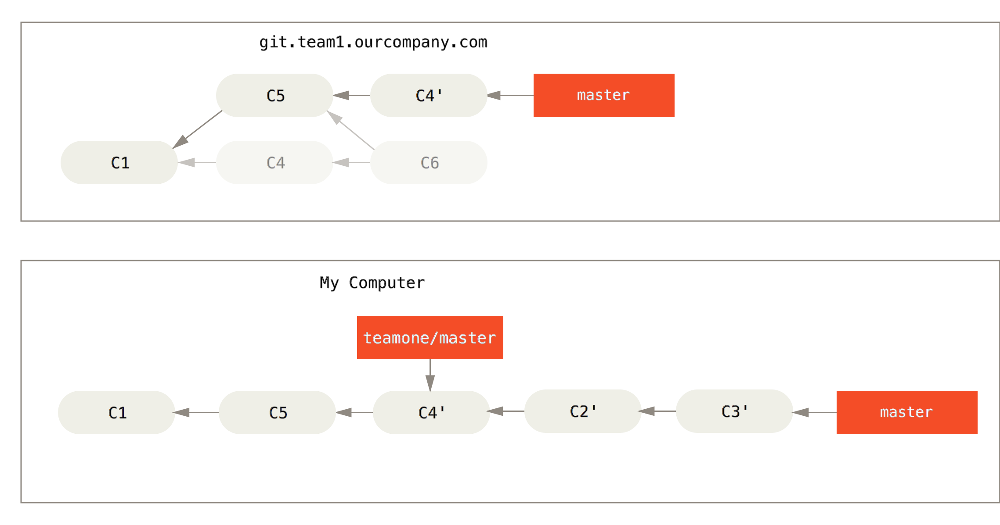

# Git branch
## Branches in a Nutshell
為了理解 Git 分支的實現方式，我們需要回顧一下 Git 是如何儲存資料的。Git 保存的不是檔差異或者變化量，而只是一系列檔快照。

在 Git 中提交時，會保存一個提交（commit）物件，該物件包含一個指向暫存內容快照的指標，包含本次提交的作者等相關附屬資訊，包含零個或多個指向該提交物件的父物件指標：首次提交是沒有直接祖先的，普通提交有一個祖先，由兩個或多個分支合併產生的提交則有多個祖先。

為直觀起見，我們假設在工作目錄中有三個檔，準備將它們暫存後提交。暫存操作會對每一個檔計算校驗和（即第一章中提到的 SHA-1 雜湊字串），然後把當前版本的檔快照保存到 Git 倉庫中（Git 使用 blob 類型的物件存儲這些快照），並將校驗和加入暫存區域：

	$ git add README test.rb LICENSE
	$ git commit -m 'initial commit of my project'

-- Todo

## 建立分支
Git 保存著一個名為 HEAD 的特別指標，指向正在工作中的本地分支。  
使用`git branch <branch name>`則可以建立新分支，但是不會切換過去。  
使用`git checkout <branch name>`則可以切換到該分之，此時 HEAD 就指向該分支。

可以使用`git log --decorate`顯示出該分支指向哪裡。
使用`git log --oneline --decorate --graph --all`將會指出當前分支指向的地方和歷史的分歧

## 分支的新建與合併
當想要建立新分支的同時切換到該分支的話，`git checkout -b <branch name>`  
當在切換分支時，Git 可能會因為衝突而阻止切換。在切換分支時最好保持一個乾淨的工作區域。  

可以使用`git merge`進行合併。

	$ git checkout master
	$ git merge hotfix
	Updating f42c576..3a0874c
	Fast-forward
	 README | 1 -
	 1 file changed, 1 deletion(-)

`Fast forward`：當前分支是要併入分支的直接上游，兩者間不存在需要解決的衝突，Git 只需要簡單地推進即可，這種過程稱為 Fast forward。  

當分支結束任務後，可以使用`git branch -d <branch name>`進行刪除。

在合併分支時，且兩個分支皆有自己的 commit 不能 fast forward 的合併時。Git 會自己裁決如何最佳合併，並自動合併重新創建一個 commit。

### 合併衝突
如果在不同分支中修改了同一份檔案的同一部分，則很可能就會發生了衝突。
類似以下的資訊：

	$ git merge iss53
	Auto-merging index.html
	CONFLICT (content): Merge conflict in index.html
	Automatic merge failed; fix conflicts and then commit the result.
	
在解決衝突後，要使用`git add`則可以將檔案標記為已解決。如果想用有 UI 的工具，可以使用`git mergetool`

## 分支管理
僅僅輸入`git branch`時將會列出所有分支的清單，前同有`*`部分則表示當前所在的分支。

	$ git branch
	  iss53
	* master
	  testing
	  
若要查看各個分支最後一個提交物件的資訊，運行`git branch -v`
如果想從清單中篩選出已經與當前分支合併或尚未合併，可以用`--merged`和`--no-merged`

清單中沒有`*`的分支通常都可以用`git branch -d`刪除。但若是要刪除尚未合併的分支，可能會有錯誤訊息，因為怕丟失資料，但還是可以使用`git branch -D`來進行刪除。

## workflow
[閱讀](https://git-scm.com/book/en/v2/Git-Branching-Branching-Workflows)

## Remote branch
遠端索引是使用者 remote repositories 的索引，包含了分支、標籤等等。可以使用`git ls-remote (remote)`或`git remote show (remote)`來取得 remote branch 的所有資訊。

它們是一些無法移動的本地分支，只有在 Git 進行網路交互時才會更新。遠端分支就像是書簽，提醒著你上次連接遠端倉庫時上面各分支的位置。
Git 使用了`(remote)/(branch)`的格式來表示 Remote branch。

>`origin`並沒有特別之處，就如同`master`一樣。Git 在自動建立 remote branch 時的預設名字而已，如要更改可以使用`git clone -o <name>`即可。

可以使用`git fetch origin`來同步遠端伺服器上的資料到本地。此命令會先找到`origin`是哪個伺服器，從上面獲取尚未擁有的字料並更新本地的資料庫，然後把`origin/master`的指針移到最新的位置。

### 推送分支
若是要推送修改的部分到遠端伺服器上，可以使用`git push <remote> <branch>` 

	$ git push origin serverfix
	Counting objects: 20, done.
	Compressing objects: 100% (14/14), done.
	Writing objects: 100% (15/15), 1.74 KiB, done.
	Total 15 (delta 5), reused 0 (delta 0)
	To git@github.com:schacon/simplegit.git
	 * [new branch]      serverfix -> serverfix

> 如果是使用了 HTTPS 的方式來推送，Git 會要求使用者帳號和密碼驗證。如果不想要每次都要驗證，可以簡單地使用`git config --global credential.helper cache`來設定 "credential.cache" 來儲存。

這裡其實走了一點捷徑。Git 自動把`serverfix`分支名擴展為`refs/heads/serverfix:refs/heads/serverfix`，意為“取出我在本地的 serverfix 分支，推送到遠端倉庫的 serverfix 分支中去”。我們將在第九章進一步介紹`refs/heads/`部分的細節，不過一般使用的時候都可以省略它。也可以運行`git push origin serverfix:serverfix`來實現相同的效果，它的意思是“上傳我本地的`serverfix`分支到遠端倉庫中去，仍舊稱它為`serverfix`分支”。通過此語法，你可以把本地分支推送到某個命名不同的遠端分支：若想把遠端分支叫作`awesomebranch`，可以用`git push origin serverfix:awesomebranch`來推送數據。

值得注意的是，在`fetch`操作下載好新的遠端分支之後，你仍然無法在本地編輯該遠端倉庫中的分支。換句話說，在本例中，你不會有一個新的`serverfix`分支，有的只是一個你無法移動的`origin/serverfix`指標。

### 跟蹤遠端分支
從遠端分支`checkout`出來的本地分支，稱作`tracking branch`。是一種和某個遠端分支有直接聯繫的本地分支。在跟蹤分支輸入`git push`，Git 會自動推斷應該向哪個伺服器的分支推送資料。同樣的`git pull`會獲取所有遠端索引，並把他們合併到本地分支。

在 clone 時，Git 會自動創建名為`master`的分支來跟蹤`origin/master`。當然可以設定為其他跟蹤分支，`git checkout -b [branch] [remotename]/[branch]`(第一個參數 branch 可設置為不同於遠端分支的名字)或者用更簡化的方式`git checkout --track [remotename]/[branch]`。

但如果使用者已經有了本地分支，而且想要改變已經在跟蹤的短端分支，可以使用`-u`或`--set-upstream-to`參數到`git branch`

	$ git branch -u origin/serverfix
	Branch serverfix set up to track remote branch serverfix from origin.
	
>Upstream 簡寫
>當已經有設定了跟蹤分支，可以使用`@{upstream}`或`@{u}`來替代。例如`git merge @{u}`可以替代成`git merge origin/master`

如果想要查看設定的跟蹤分支，可以使用`git branch -vv`。會提供所有的跟蹤分支資訊和離最新版差了多少。

	$ git branch -vv
	  iss53     7e424c3 [origin/iss53: ahead 2] forgot the brackets
	  master    1ae2a45 [origin/master] deploying index fix
	* serverfix f8674d9 [teamone/server-fix-good: ahead 3, behind 1] this should do it
	  testing   5ea463a trying something new
	  
如果想全部都更新到最新的話可以使用`git fetch --all`

### pull
雖然`git fetch`會抓下所有伺服器上我沒有的更改的部分，但是並不會更改我的工作目錄，使用者需要自己合併。此使我們可以使用`git pull`來取代這些動作，大部分的使用會省掉許多操作。在`clone`和`checkout`時都是使用了此命令。

### 刪除遠端分支
我們要刪除遠端分支時，可以使用`git push <remotename> --delete <branch>`

	$ git push origin --delete serverfix
	To https://github.com/schacon/simplegit
	 - [deleted]         serverfix

但刪除之後 Git 還是會保留資料一段時間，直到 garbage collection 執行。所以如果不小心誤刪的話還是可以馬上回覆的。

## Rebase
在 Git 中有兩種主要合併分支的方式：`merge`和`rebase`。

* `Merge`：
它會把兩個分支最新的快照（C3 和 C4）以及二者最新的共同祖先（C2）進行三方合併，合併的結果是產生一個新的提交物件（C5）。

* `Rebase`：
會把 C3 裡的變化在 C4 的基礎上重新寫入。這樣就可以把在一個分支裡提交的改變移到另一個分支裡重放一遍。  

		$ git checkout experiment
		$ git rebase master
		First, rewinding head to replay your work on top of it...
		Applying: added staged command

雖然 rebase 和 merge 最後產生出來的會是一模一樣的結果，但是 rebase 可以產生一個非常乾淨的 commit 歷史記錄。所有的紀錄都會在一條分支上。
`rebase`是按照每行的修改次序重演一遍修改，而`merge`是把最終結果合在一起。

### more usage
rebase 可以與其他不是基底分支來進行。例如在 master 分支創建了 server 分支並 commit 了 C3 和 C4。然後又從 C3 的地方創建 client 分支並 commit 了 C8 和 C9。最後回到 server 並 commit 了 C10。
而我們可以直接將 client rebase 到 master

但是這樣將會需要用到`git rebase`的`--onto`指定新的基底分支`master`

	$ git rebase --onto master server client
	
>取出`client`分支，找出`clinet`和`server`的共同祖先之後的變化，並在`master`重新寫入。雖然在 C3 有重疊，但是只會放入 C8 和 C9 的變化。

`git rebase [主分支] [特性分支]`

### Rebase 的風險
Rebase 在操作上也有一些限制，**"Do not rebase commits that exist outside your repository."**

意指當有人已經在 commit 的資料上開發的話，就不適合用 rebase 的操作。
[see more](https://git-scm.com/book/zh-tw/v1/Git-%E5%88%86%E6%94%AF-%E5%88%86%E6%94%AF%E7%9A%84%E8%A1%8D%E5%90%88)

但是 Git 可以幫助你解決類似的問題，可以使用`git rebase <remote/branch>`。除了在 commit 時 Git 會有 SHA-1 的驗證外，Git 也計算這些 patch 的校正，叫做 "patch-id"。當在 pull 被共同編輯者覆蓋或 rebase 的資料時，Git 會辨別出哪些是你分支上的變化和還沒 merge 的 commit 還有在目標分支上被覆蓋的 commit。

這個操作只有在 C4 和 C4' 產生幾乎一樣的 patch。也可以使用`git pull --rebase`取代一般的`git pull`。或是使用`git fetch`後接著用`git rebase <remote/branch>`。

如果想要在每次用`git pull`時都自動加上`--rebase`，可以設定在設定檔裡`git config --global pull.rebase true`。
